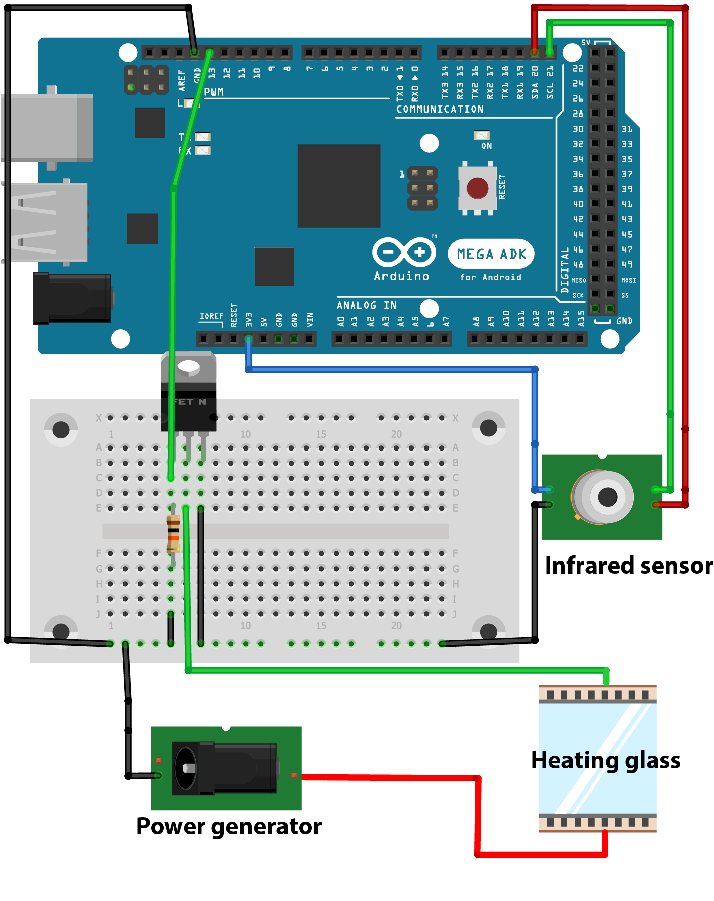

.ino to use with the .m, to have plots in realtime. Otherwise, use standalone.m

**List of components:**
* ITO glass: https://www.adafruit.com/product/1310
* Infrared sensor: MLX90614ESF-DCI-000-SP
* MOSFET: IPP052N06
* Resistance: 10kOhm
* Arduino
* 3D printed sensor holder (cf sensor_holder.f3d file)

**Electronic circuit**

